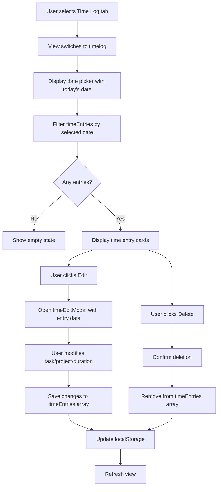

# Time Log Feature - Implementation Plan

## Overview
Add a new "Time Log" view to the Pomodoro timer application that allows users to view, edit, and delete individual time entries for any selected day.

## Current State Analysis

### Existing Components
- **Data Structure**: Time entries stored in [`localStorage`](js/pomodoro-app.js:1217) with structure:
  ```javascript
  {
    id: UUID,
    taskId: string,
    projectId: string,
    startTime: timestamp,
    endTime: timestamp,
    duration: seconds,
    date: 'YYYY-MM-DD',
    pomodorosCompleted: number
  }
  ```
- **Views**: Timer, Projects, Summary (3 tabs)
- **Edit Modal**: Existing [`showTimeEditModal`](pomodoro.html:1686) for editing time entries
- **Delete Function**: [`deleteTimeEntry()`](js/pomodoro-app.js:1573) already implemented

### Integration Points
1. Navigation tabs at line ~1190 in [`pomodoro.html`](pomodoro.html:1190)
2. View switching logic in [`data()`](js/pomodoro-app.js:452) - `currentView` property
3. Time entry management methods in [`js/pomodoro-app.js`](js/pomodoro-app.js:1470-1577)

## Feature Design

### UI Layout

```
┌─────────────────────────────────────────────────────────┐
│  Timer  │  Projects  │  Summary  │  [Time Log]          │
└─────────────────────────────────────────────────────────┘

┌─────────────────────────────────────────────────────────┐
│  Time Log                                                │
│                                                          │
│  [Date Picker: 2026-04-14 ▼]                           │
│                                                          │
│  ┌────────────────────────────────────────────────────┐ │
│  │ 🔴 Project Name                                     │ │
│  │ Task Name                                           │ │
│  │ 2:30 PM - 2:55 PM  (25 min)  [Edit] [Delete]      │ │
│  └────────────────────────────────────────────────────┘ │
│                                                          │
│  ┌────────────────────────────────────────────────────┐ │
│  │ 🟢 Another Project                                  │ │
│  │ Another Task                                        │ │
│  │ 3:00 PM - 4:00 PM  (1h 0m)   [Edit] [Delete]      │ │
│  └────────────────────────────────────────────────────┘ │
│                                                          │
│  Total: 1h 25m (3 pomodoros)                           │
└─────────────────────────────────────────────────────────┘
```

### Component Breakdown

#### 1. Time Log View Container
- **Location**: New section in [`pomodoro.html`](pomodoro.html:1351) after Summary view
- **Visibility**: `v-show="currentView === 'timelog'"`
- **CSS Class**: `.timelog-view` (similar to `.summary-view`)

#### 2. Date Picker
- **Type**: HTML5 `<input type="date">`
- **Default**: Today's date
- **Data binding**: New `timeLogDate` property in [`data()`](js/pomodoro-app.js:409)
- **Styling**: Match existing `.setting-input` style

#### 3. Time Entry Card
- **Structure**:
  - Project color indicator (circle)
  - Project name
  - Task name
  - Time range (start - end)
  - Duration display
  - Action buttons (Edit, Delete)
- **CSS Class**: `.time-entry-card`
- **Layout**: Flexbox with responsive design

#### 4. Empty State
- **Condition**: No entries for selected date
- **Message**: "No time entries for this date. Start tracking time by selecting a task and starting a pomodoro!"
- **CSS Class**: `.empty-state` (reuse existing)

## Implementation Steps

### Step 1: Add Navigation Tab
**File**: [`pomodoro.html`](pomodoro.html:1190)
- Add fourth tab button after "Summary"
- Label: "Time Log"
- Click handler: `@click="switchView('timelog')"`
- Active class binding: `:class="{ active: currentView === 'timelog' }"`

### Step 2: Add Data Properties
**File**: [`js/pomodoro-app.js`](js/pomodoro-app.js:452)
- Add `timeLogDate: getTodayString()` to data object
- Ensure `currentView` can handle 'timelog' value

### Step 3: Create Computed Property
**File**: [`js/pomodoro-app.js`](js/pomodoro-app.js:470)
```javascript
filteredTimeEntries() {
  return this.timeEntries
    .filter(e => e.date === this.timeLogDate)
    .sort((a, b) => a.startTime - b.startTime);
}
```

### Step 4: Create Helper Methods
**File**: [`js/pomodoro-app.js`](js/pomodoro-app.js:1470)
```javascript
formatTimeRange(startTime, endTime) {
  const start = new Date(startTime);
  const end = new Date(endTime);
  return `${start.toLocaleTimeString('en-US', { 
    hour: 'numeric', 
    minute: '2-digit' 
  })} - ${end.toLocaleTimeString('en-US', { 
    hour: 'numeric', 
    minute: '2-digit' 
  })}`;
}

getProjectForEntry(entry) {
  return this.projects.find(p => p.id === entry.projectId);
}

getTaskForEntry(entry) {
  return this.tasks.find(t => t.id === entry.taskId);
}
```

### Step 5: Build Time Log View HTML
**File**: [`pomodoro.html`](pomodoro.html:1400)
```html
<!-- Time Log View -->
<div v-show="currentView === 'timelog'" class="timelog-view">
  <div class="timelog-header">
    <h2>Time Log</h2>
    <input 
      type="date" 
      v-model="timeLogDate"
      class="date-picker"
    />
  </div>

  <!-- Empty State -->
  <div v-if="filteredTimeEntries.length === 0" class="empty-state">
    <p>No time entries for this date.</p>
  </div>

  <!-- Time Entries List -->
  <div v-else class="timelog-content">
    <div 
      v-for="entry in filteredTimeEntries" 
      :key="entry.id"
      class="time-entry-card"
    >
      <div class="entry-header">
        <span 
          class="project-color" 
          :style="{ backgroundColor: getProjectForEntry(entry)?.color }"
        ></span>
        <div class="entry-info">
          <h4>{{ getProjectForEntry(entry)?.name }}</h4>
          <p>{{ getTaskForEntry(entry)?.name }}</p>
        </div>
      </div>
      <div class="entry-details">
        <span class="time-range">
          {{ formatTimeRange(entry.startTime, entry.endTime) }}
        </span>
        <span class="duration">
          {{ formatDuration(entry.duration) }}
        </span>
      </div>
      <div class="entry-actions">
        <button 
          class="btn btn-secondary btn-sm"
          @click="openTimeEditModal(entry)"
        >
          Edit
        </button>
        <button 
          class="btn btn-danger btn-sm"
          @click="deleteTimeEntry(entry.id)"
        >
          Delete
        </button>
      </div>
    </div>

    <!-- Daily Total -->
    <div class="timelog-total">
      <strong>Total:</strong>
      {{ formatDuration(filteredTimeEntries.reduce((sum, e) => sum + e.duration, 0)) }}
      ({{ filteredTimeEntries.reduce((sum, e) => sum + e.pomodorosCompleted, 0) }} pomodoros)
    </div>
  </div>
</div>
```

### Step 6: Add CSS Styles
**File**: [`pomodoro.html`](pomodoro.html:946)
```css
/* Time Log View */
.timelog-view {
  max-width: 800px;
  margin: 0 auto;
}

.timelog-header {
  display: flex;
  justify-content: space-between;
  align-items: center;
  margin-bottom: 24px;
  flex-wrap: wrap;
  gap: 16px;
}

.timelog-header h2 {
  font-size: 24px;
  font-weight: 700;
  color: var(--fg);
}

.date-picker {
  padding: 10px 16px;
  border: 1px solid var(--border);
  border-radius: 8px;
  background: var(--bg-card);
  color: var(--fg);
  font-family: var(--sans);
  font-size: 14px;
  cursor: pointer;
  transition: border-color 0.2s ease;
}

.date-picker:hover {
  border-color: var(--current-color);
}

.date-picker:focus {
  outline: none;
  border-color: var(--current-color);
  box-shadow: 0 0 0 3px rgba(217, 85, 80, 0.1);
}

.timelog-content {
  display: flex;
  flex-direction: column;
  gap: 16px;
}

.time-entry-card {
  background: var(--bg-card);
  border: 1px solid var(--border);
  border-radius: var(--radius);
  padding: 20px;
  box-shadow: var(--shadow-sm);
  transition: box-shadow 0.2s ease, transform 0.2s ease;
}

.time-entry-card:hover {
  box-shadow: var(--shadow-md);
  transform: translateY(-2px);
}

.entry-header {
  display: flex;
  align-items: center;
  gap: 12px;
  margin-bottom: 12px;
}

.entry-info h4 {
  font-size: 16px;
  font-weight: 600;
  color: var(--fg);
  margin: 0 0 4px 0;
}

.entry-info p {
  font-size: 14px;
  color: var(--fg-muted);
  margin: 0;
}

.entry-details {
  display: flex;
  justify-content: space-between;
  align-items: center;
  margin-bottom: 16px;
  padding: 12px;
  background: var(--bg);
  border-radius: 6px;
}

.time-range {
  font-size: 14px;
  color: var(--fg-muted);
}

.duration {
  font-size: 14px;
  font-weight: 600;
  color: var(--current-color);
}

.entry-actions {
  display: flex;
  gap: 8px;
  justify-content: flex-end;
}

.btn-sm {
  padding: 8px 16px;
  font-size: 13px;
}

.btn-danger {
  background: #dc3545;
  color: white;
}

.btn-danger:hover {
  background: #c82333;
}

.timelog-total {
  margin-top: 8px;
  padding: 16px;
  background: var(--bg-card);
  border: 2px solid var(--current-color);
  border-radius: var(--radius);
  text-align: center;
  font-size: 16px;
  color: var(--fg);
}

/* Responsive Design */
@media (max-width: 640px) {
  .timelog-header {
    flex-direction: column;
    align-items: stretch;
  }
  
  .date-picker {
    width: 100%;
  }
  
  .entry-details {
    flex-direction: column;
    gap: 8px;
    align-items: flex-start;
  }
  
  .entry-actions {
    width: 100%;
  }
  
  .entry-actions button {
    flex: 1;
  }
}
```

### Step 7: Enhance Edit Modal
**Current**: Edit modal already exists at [`pomodoro.html:1686`](pomodoro.html:1686)
**Enhancement**: Ensure task dropdown allows changing to any task/project
- Modal already supports task selection via dropdown
- Grouped by project for easy navigation
- No changes needed - existing implementation is sufficient

### Step 8: Test Integration
- Verify date picker updates filtered entries
- Test edit button opens modal with correct data
- Test delete button removes entry and updates view
- Verify task/project changes persist correctly
- Check localStorage updates after each operation
- Test empty state display
- Verify responsive design on mobile

## Data Flow Diagram



## Key Features

### 1. View All Entries
- Display all time entries for selected date
- Sort chronologically (earliest first)
- Show project color, name, task name
- Display time range and duration

### 2. Edit Entry
- Click "Edit" button on any entry
- Opens existing time edit modal
- Pre-populated with entry data
- Can change task (which changes project)
- Can modify duration
- Can change date

### 3. Delete Entry
- Click "Delete" button on any entry
- Confirmation dialog (already implemented)
- Removes from array and localStorage
- View updates immediately

### 4. Date Navigation
- HTML5 date picker for easy selection
- Defaults to today
- Can view any historical date
- Can view future dates (for planning)

### 5. Summary Display
- Total time for selected day
- Total pomodoros count
- Displayed at bottom of entries list

## Technical Considerations

### Performance
- Time entries filtered client-side (fast for reasonable data volumes)
- Consider pagination if user has >100 entries per day
- Computed property ensures reactive updates

### Data Integrity
- Existing [`saveTimeEntries()`](js/pomodoro-app.js:1224) handles persistence
- UUID ensures unique entry IDs
- Date format 'YYYY-MM-DD' ensures consistent filtering

### User Experience
- Smooth transitions between views
- Hover effects on cards for interactivity
- Responsive design for mobile use
- Clear visual hierarchy
- Accessible buttons and controls

### Edge Cases
- No projects/tasks: Show message to create them first
- Deleted project/task: Handle gracefully with fallback display
- Invalid date selection: HTML5 date picker prevents this
- Concurrent edits: localStorage updates are synchronous

## Success Criteria

- ✅ New "Time Log" tab visible and functional
- ✅ Date picker allows selecting any date
- ✅ All time entries for selected date displayed
- ✅ Each entry shows project, task, time range, duration
- ✅ Edit button opens modal with correct data
- ✅ Task/project can be changed via dropdown
- ✅ Delete button removes entry after confirmation
- ✅ Changes persist to localStorage
- ✅ View updates reactively after changes
- ✅ Empty state displays when no entries
- ✅ Daily total calculated correctly
- ✅ Responsive design works on mobile
- ✅ Matches existing design system

## Future Enhancements (Out of Scope)

- Export time log to CSV/PDF
- Bulk edit/delete operations
- Time entry templates
- Recurring time entries
- Time entry notes/comments
- Calendar view with month navigation
- Week view with daily summaries
- Search/filter by project or task
- Time entry analytics and insights